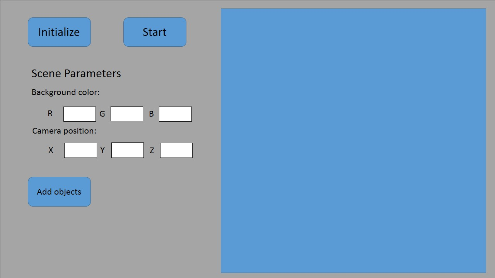
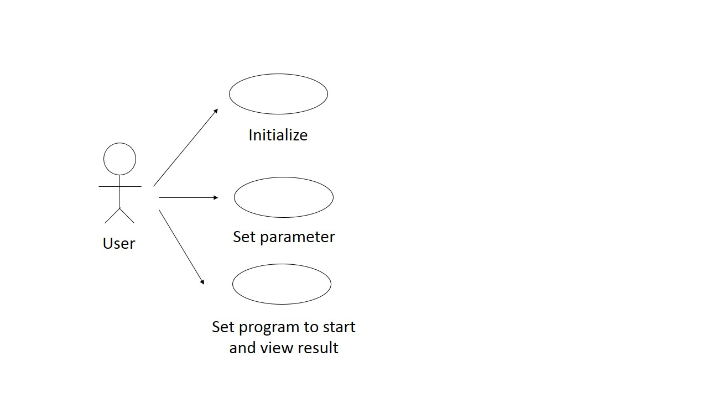
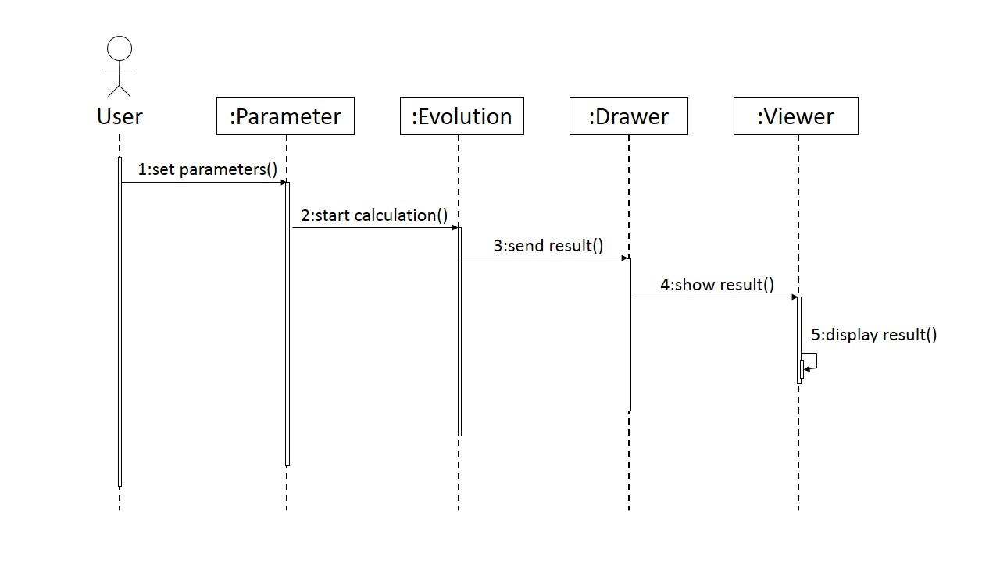
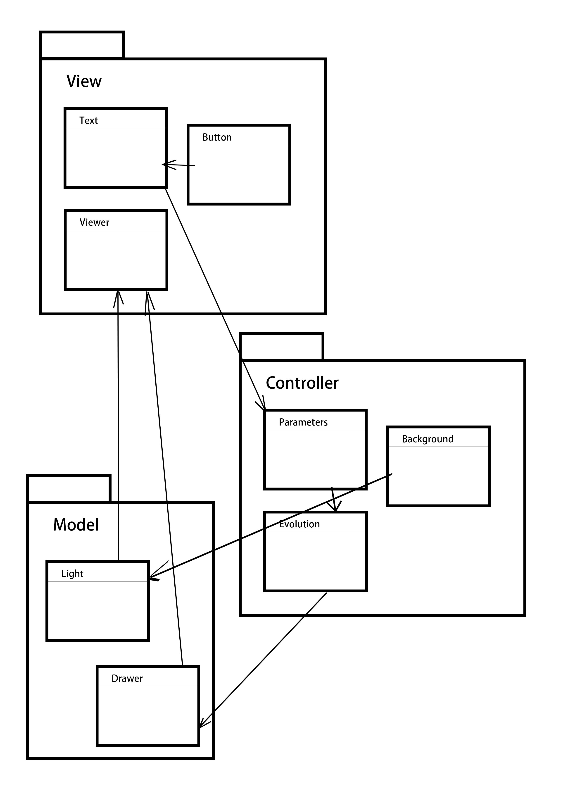

#某个物理引擎说明文档
####某个队
####成员：吕铭，梁岩，余欣彤，彭昊旻
###1. 引言
####1.1 目的
实现一个模拟牛顿力学的计算模型， 包括多种三维物体的运动、碰撞等计算。
####1.2 预期的读者
对开发和使用此引擎感兴趣的用户。
####1.3 产品范围
三维物体碰撞的模拟， 适用于物理仿真、游戏开发等项目。
###2. 综合描述
####2.1 产品的前景
用于物理仿真和游戏开发。
####2.2 产品的功能
实现三维物体运动计算碰撞检测。
####2.3 用户特征
阅读过此文档、能够使用c++调用本引擎接口的用户。
####2.4 运行环境
Windows、Linux & Mac OS等多种桌面级系统。
####2.5 设计和实现限制
硬件限制： 程序开发于Core i5 CPU、8Gb内存的系统。

协议： 采用GPL协议发布。
####2.6 假设和依赖
使用牛顿力学作为理论依据，使用OpenGL作为展示方式。
###3. 外部接口需求
####3.1 用户界面

####3.2 软件接口: 
对接OpenGL接口展示运算结果。
###4. 系统特性
#####4.1.1 用例图

#####4.1.2 用例Glossary
|名词|定义说明|
| -----|:----:|
|user|程序用户，使用此程序的任何人|

#####4.1.3 用例说明
i. 简介

用户通过初始化界面、设置参数，使物理引擎计算用户假设条件下的物体碰撞的演化情况，以动画的形式展现。

ii. 角色

User：程序用户

iii. 前置条件

1) 可以是刚打开界面，也可以是程序正在运行

iv. 后置条件

1) 计算、动画显示将一直持续，直到用户选择重新初始化或关闭程序

v. 基本事件流

1) 用户打开程序。

2) 用户点击“Initialize”按钮，如果此时物理引擎正在运行，则计算停止，动画消失，完成初始化；否则直接完成初始化。

3) 用户选择Scene

parameters中的参数，设置场景参数；通过点击Addobjects按钮增加新的物体，并设置物体参数。

4) 用户点击“Start”按钮，物理引擎开始运行，动画开始显示，用户可以观察结果。

vi. 扩展事件流

1) 若用户输入的参数错误，如RGB设置超出范围、物体大小与位置关系有矛盾等，则出现错误提示对话框，表明错误的具体类型，提醒用户重新输入。

####4.2 时序图
如图所示

####4.3包图
如图所示

###5. 其他非功能需求
####5.1 性能需求
 流畅的计算出在程序限定最大空间大小下5个球体以下的无旋转的运动和碰撞轨迹.
####5.2 软件质量属性
确保软件的正确性、性能和可移植性， 其次保证其健壮性可靠性和易用性。
####5.3 用户文档
用户使用此软件初始化环境和物体模拟碰撞。

a) 初始化环境

首先点击Initialize初始化界面。 然后输入camera position的坐标和background color完成环境的初始化。

b) 设置物体

使用Add objects， 设置物体大小位置颜色和速度。

c) 程序运行

点击start观察系统运行结果。

